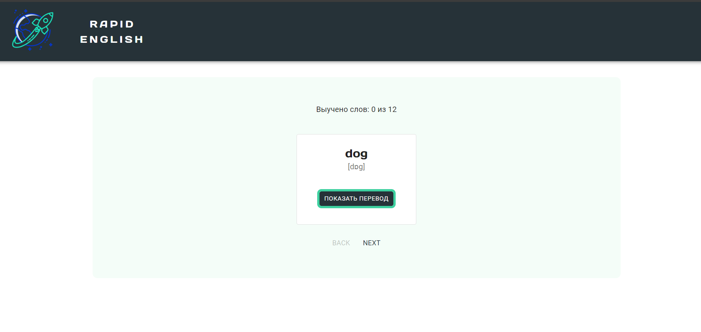
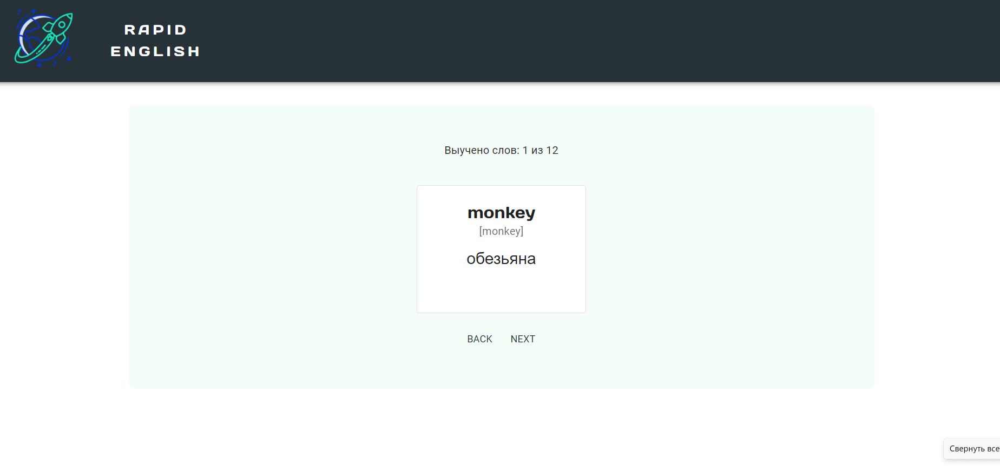
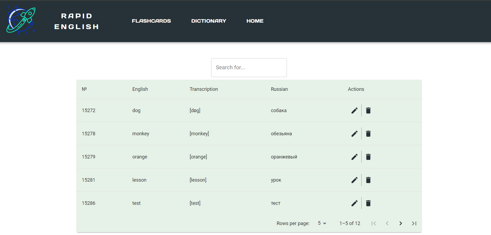
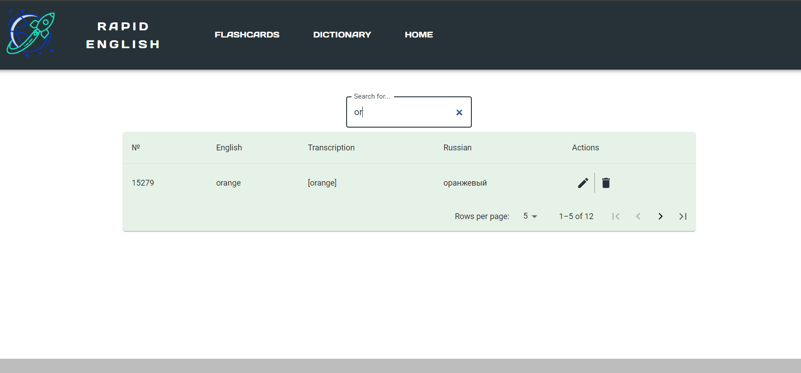
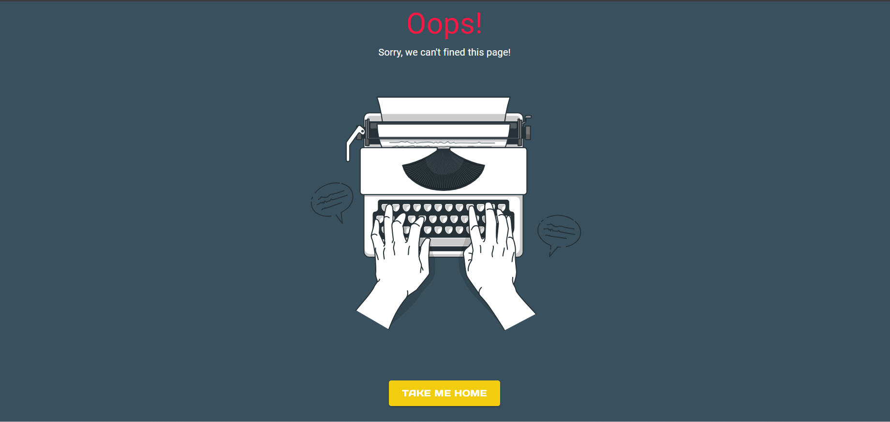

# Languages-app
Приложение для изучения английского языка. <br> 
Создавалось в рамках обучения в школе ITGirls School.
В работе использовалась библиотека Material UI, реализующая Material Design от Google. <br> 
Состоит из двух компонентов: карточек для запоминания слов и словаря, с возможностью редактирования/удаления/добавления новых слов, а также поиска по словам. 
#### Карточки:



#### Словарь:



#### Error-page:


## Содержание
- [Технологии](#технологии)
- [Использование (запуск проекта)](#использование)
- [Источники](#источники)

## Технологии
- JavaScript
- [React](https://react.dev/)
- [HTML5](https://...)
- [Material UI](https://mui.com/material-ui/getting-started/)

## Использование
Приложение создано с помощью [Create React App](https://create-react-app.dev/docs/getting-started).<br>
Для запуска проекта на своем компьютере сделайте ```форк``` и клонируйте репозиторий: ```git clone https://github.com/StoneTanya/languages-app.git```<br>
Перейдите в папку с проектом ```cd languages-app```<br>
Установите зависимости: ```npm install```<br>
Запустите проект: ```npm start```<br>
Откройте http://localhost:3000 , чтобы увидеть приложение в своем браузере.<br>

## Источники
Верстка по макету [figma](https://www.figma.com/file/BURn7pFfYgigkgQfvMNniz/Landing?type=design&node-id=0-1&mode=design).

